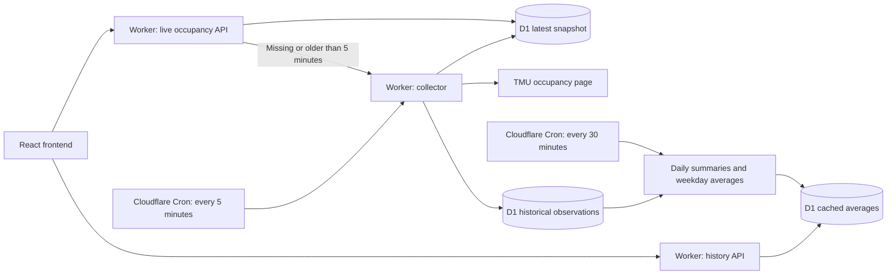

# TMU Gym Status

A problem I run into a lot is wanting to go to the RAC or MAC but I'm never sure if there could be a more optimal time to go when it's less busy (especially since summer just ended).

I came up with a simple way to check how busy Toronto Metropolitan University’s gyms are before heading over!

TMU publishes occupancy for several recreation spaces, but deciding when to go means checking each space and knowing little about how busy it might be later. This project brings all six spaces into a compact, mobile-friendly view and collects historical readings to help explore better times to visit.

[Open the app](https://tmu-gym-status.tmu-gym-status.workers.dev/) · [TMU occupancy source](https://recportal.torontomu.ca/FacilityOccupancy)

## What it does

- Shows the latest collected occupancy for all six TMU gym spaces, with MAC and RAC Fitness Centres grouped under **Popular**.
- Displays percentages, animated occupancy bars, and simple activity labels: green below 35%, yellow from 35% to below 65%, and red at 65% or above. These are the app’s labels, not TMU classifications.
- Reveals quieter alternatives when you hover, focus, or tap a facility. Suggestions compare historical averages with the current reading.
- Lets you choose a future Toronto-local date and time and see estimated occupancy using the same bar layout.
- Supports light, dark, and system appearance, remembers your preference, and respects reduced motion.
- Shares readings across visitors for five minutes. If scheduled collection falls behind, opening the page or pressing Refresh can recover a live reading through the same coordinated collector.

The six spaces are MAC Fitness Centre, RAC Fitness Centre, RAC 1 Gym (LL3), RAC II Gym (LL3), RAC Cardio & Strength Circuit Room, and RAC Functional Training Room.

## Architecture

The frontend and API run on the same Cloudflare Worker deployment. The browser reads results through the app’s API. Cron and live requests share a database lease: one collector fetches TMU when the snapshot needs refreshing, while other visitors reuse the saved result.

Live requests reuse snapshots younger than five minutes. Cron allows fifteen seconds of scheduling tolerance so source latency does not cause it to skip alternate five-minute ticks. When a refresh is needed, the collector parses TMU’s HTML with native HTMLRewriter and atomically saves the snapshot and historical observations to D1. Concurrent cold requests briefly wait for that shared result. Observations are deduplicated by facility and five-minute slot; cache hits never create samples. A separate scheduled invocation updates daily summaries and reusable weekday averages every thirty minutes, keeping that work out of live collection and visitor requests.

Refresh uses the same five-minute freshness rule. Failed attempts have a shared one-minute retry cooldown, and abandoned collector leases expire after one minute. Readings become stale after ten minutes or a failed collection and become unavailable after thirty minutes. Failed collection preserves the previous snapshot; partial collections explicitly mark missing facilities unavailable. Historical averages expire after 24 hours without a successful refresh, independently of live readings.

Cron and visitor recovery share the same database lock, with ownership checks on publication to prevent an expired collector from overwriting a newer result. Failed fetches and missing values remain gaps; they never become zero occupancy or fabricated observations. Collection follows Toronto time and excludes configured Ontario holidays, including Civic Holiday. A collection exclusion does not necessarily mean the gym is closed.

## Learning from the data

Historical estimates group readings by facility, weekday, and 30-minute period. It averages each contributing day first, then gives those daily averages equal weight. A heavily sampled day therefore does not outweigh another day.

Early estimates can use a single qualifying day. Matching weekdays take priority; missing weekday slots can use labelled weekday averages. Unsupported times remain unavailable. Nearby recommendations stay within three hours and leave at least an hour before closing. Live-view alternatives must average at least five percentage points below the current reading. A separate later-today estimate can identify a quieter remaining slot beyond that window.

Estimates use a rolling 56-day history window, require at least three distinct five-minute readings per contributing daily bucket, and require a contributing date within the last 21 days. A week of collection provides roughly one example of each weekday, so the estimates are an early reference rather than a reliable recurring pattern. Repeated or delayed source readings can also affect the averages.

## Stack

| Layer | Technology |
| --- | --- |
| Interface | React, TypeScript, Tailwind CSS |
| Development and build | Vite |
| Hosting and API | Cloudflare Workers |
| Scheduled collection | Cloudflare Cron Triggers |
| Snapshots, observations, and cached averages | Cloudflare D1 |
| Validation | Vitest and local D1 integration tests |

## Project status

The app includes current occupancy, historical estimates, quieter-time suggestions, saved appearance preferences, and scheduled collection with shared snapshots. It is a personal project being refined for broader use. Missing data stays unavailable; estimates are not guarantees of future occupancy.

See the [open issues](https://github.com/maibrandon/tmu-gym-status/issues) for ongoing improvements.

---

An unofficial student project, not affiliated with TMU. Occupancy comes from TMU’s published page and may lag behind conditions at the gym. Collection timestamps describe when this app fetched a reading; TMU’s underlying measurement time is not currently available.
