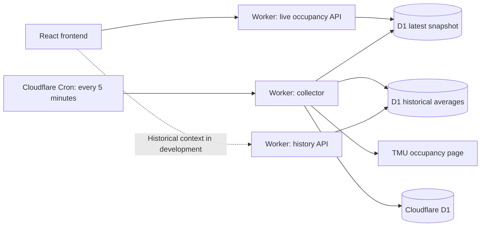

# TMU Gym Status

A problem I run into a lot is wanting to go to the RAC or MAC but I'm never sure if there could be a more optimal time to go when it's less busy (especially since summer just ended).

I came up with a simple way to check how busy Toronto Metropolitan University’s gyms are before heading over!

TMU publishes occupancy for several recreation spaces, but deciding when to go means checking each space and knowing little about how busy it might be later. This project brings all six spaces into a compact, mobile-friendly view and collects historical readings to help explore better times to visit.

[Open the app (domain will be updated when prod-ready)](https://tmu-gym-status.tmu-gym-status.workers.dev/) · [TMU occupancy source](https://recportal.torontomu.ca/FacilityOccupancy)

## What it does

- Shows live occupancy for MAC Fitness Centre and five RAC spaces.
- Uses simple occupancy bars and numeric percentages for quick comparison.
- Supports light, dark, and system appearance, with a saved device preference.
- Collects readings approximately every five minutes during configured collection hours, independently of site visitors.

**Historical context is in development.** The initial implementation lets users choose a Toronto-local date and time, see early occupancy estimates, and explore alternatives supported by the available data. It is not yet deployed to the public app.

## Architecture

The frontend and API run on the same Cloudflare Worker deployment. The browser reads saved results through the app’s API. Only the scheduled collector fetches and parses TMU’s HTML, so visitor traffic does not increase requests to TMU.

Live requests return the latest collected snapshot. The scheduled collector atomically saves that snapshot and new historical observations to D1, then refreshes reusable weekday averages. Visitor requests neither scrape TMU nor add historical samples, so traffic does not bias the dataset.

Refresh rereads the shared snapshot. Readings become stale after ten minutes or a failed collection and become unavailable after thirty minutes. Failed collection preserves the previous snapshot; partial collections explicitly mark missing facilities unavailable. Historical averages expire after 24 hours without a successful refresh, independently of live readings.

Collection runs use unique five-minute slots and a database lock to prevent duplicate scheduled work. Failed fetches and missing values remain gaps; they never become zero occupancy or fabricated observations. Collection follows Toronto time and excludes configured holidays.

## Learning from the data

The exploratory history implementation groups readings by facility, weekday, and 30-minute period. It averages each contributing day first, then gives those daily averages equal weight. A heavily sampled day therefore does not outweigh another day.

Early estimates can use a single qualifying day. Matching weekdays take priority; missing weekday slots can use labelled weekday averages. Unsupported times remain unavailable. Nearby recommendations stay within three hours and leave at least an hour before closing. Live-view alternatives must average at least five percentage points below the current reading. A separate later-today estimate can identify a quieter remaining slot beyond that window.

A week of collection provides roughly one example of each weekday—not a reliable recurring pattern. Broader coverage and stronger validation are the next steps before treating these estimates as typical occupancy.

## Stack

| Layer | Technology |
| --- | --- |
| Interface | React, TypeScript, Tailwind CSS |
| Development and build | Vite |
| Hosting and API | Cloudflare Workers |
| Scheduled collection | Cloudflare Cron Triggers |
| Historical storage | Cloudflare D1 |
| Validation | Vitest and local D1 integration tests |

## Project status

Live occupancy, dark mode, scheduled collection, and GitHub-triggered production deployments are working. Historical estimates and alternatives are being developed in [issue #3](https://github.com/maibrandon/tmu-gym-status/issues/3); shared caching is tracked in [issue #4](https://github.com/maibrandon/tmu-gym-status/issues/4).

---

An unofficial student project, not affiliated with TMU. Occupancy comes from TMU’s published page and may lag behind conditions at the gym. Collection timestamps describe when this app fetched a reading; TMU’s underlying measurement time is not currently available.
